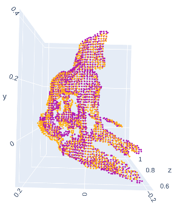

# Stereo Vision 3D Object Reconstruction

3D object reconstruction using stereo vision is a
cutting-edge technology that allows the creation of realistic 3D models
that can be used in product design, marketing materials, and
more. The goal of this work is to obtain accurate 3D models
using computer vision approaches. This system involves the use
of two cameras to capture multiple images of an object from
different viewpoints, then depth information is extracted from
the images and used to reconstruct a 3D model of the object.


## Dependencies

* [Python](https://www.python.org/)
* [OpenCV](https://opencv.org/)
* [Open3D](http://www.open3d.org/)
* [Numpy](https://numpy.org/)
* [Matplotlib](https://matplotlib.org/)

## Usage

Let's explain how to use the system:

* ```stereo_vision_calibration.ipynb```: Compute stereo vision calibration, rectification and disparity maps
* ```reconstruction.ipynb```: Compute point clouds and merge them

## Example of partial 3D reconstruction
<p align='center'>
  
</p>
